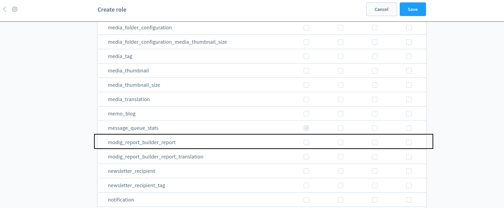

# User manual

### Summary
 - [Admin menu](#admin-menu)
 - [Report List](#report-list)
 - [Creating / editing a report](#creating--editing-a-report)
   - [General settings](#general-settings)
   - [Report Columns](#report-columns)
   - [Conditions](#conditions)
 - [Generating a report](#generating-a-report)
 - [Access Control](#access-control)
 - [Exporting a report](#exporting-a-report)
 

### Admin menu
After installing the Modig Report Builder plugin, a new menu item is available under the main “Marketing“ menu, called “Report Builder“. This gives you access to the report builder functionality.

Clicking the Report Builder menu item will take you to the existing reports list. Initially the list will be empty. 

### Report List

The report list is a regular Shopware list with columns, that can be filtered, sorted and paginated.

By default, the list contains 3 data columns visible:

- Report title  
- Report Type  
- Date interval  

And 2 hidden columns:

- From Date  
- To Date  

The existing reports can be filtered by report type, interval and from-to date.

Each existing report has an “action“ column with 3 different actions:

- Edit  
- Generate report  
- Delete  

### Creating / editing a report
You can create a new report by clicking on the “Create new Report“ button on the top right side of the report list.  
Clicking the button will take you to an intermediary screen where you can select the report type.
  

If the plugin has 2 or more report types a dropdown will be available near the  “Create new Report“ button with the available report types. Selecting an option will take you to the creation screen without the intermediary step.  
To edit a report click on the “Edit“ menu item in the report list.  
When adding or editing a report you will see a list of fields that need to be filled in, split into 3 sections: general settings, report columns, and conditions.  

#### General settings

In this section you can fill in:

- Report title - a text field used to identify the report.
- Description - a text area field with editor. This is intended for internal use and has no meaning in the report generation.
- Date Interval - a dropdown with the available intervals which filters the report based on the entity created_at field. this interval can be changed when generating the report to get the data for the same report but different periods.  Depending on the configuration of the entity the interval might be missing if the entity does not support a created_at field.
- From Date - To Date - date time fields acting the same as the interval but you can select specific date time values. They can also be missing if the interval field is missing.

#### Report Columns
In this section you can select from the predefined fields, the ones you want to get in your report,  and apply different operations, grouping and sorting. You can move the columns in the desired order or you can delete them.

- Select Column - a dropdown with all the available columns for your report type.
- Label - a text field you can fill in with a custom value. If left blank it will be autogenerated based on the column selected and the operation: 
  - Column = Total Amount, operation = none will result in the label “Total amount“.
  - Column = Net Amount, operation = “Average“ will result in the field label “Average Net Amount“.
- Operation - one of the operations that can be applied on the field depending on the type: 
- Group by this - a checkbox allowing you to group the results based on the selected field. Useful if you want to count records based on some fields or values.
- Sort - you can sort ascending or descending based on the value of the field. Multiple sorts will be applied based on the order in which they are defined.
- Move - you can move the column up or down. this is just for visual effect in the generated report.
- Delete: Remove columns you don’t need anymore in the current report.

#### Conditions

In the conditions section, you can apply filters to the entities for which you create a report.

There are 2 types of conditions: 

- A regular condition where you select a field a comparison and a specific value to compare the field.
- A grouped condition, that contains regular conditions where they all need to be true (AND condition) or where at least one needs to be true (OR condition).

For each condition, regular or grouped you can move them up or down, insert one before or after or delete them from the actions icons.

Changing the order of the conditions should not affect the result of the report but it may speed it up in certain cases.

After filling in the report data you can save the report from the top left button.

The save button comes with 4 different actions:

- Save: Clicking the save button will save the report and keep you in the report edit screen.
- Save and Duplicate will save the report and create a copy if it and you will remain in the edit screen of the duplicated report.
- Save and Generated will save the report and will take you to the generation page.
- Save and Close will save the report and take you to the report list screen.

### Generating a report
You can generate an existing report from the report list by clicking the “Generate“ link in the action dropdown menu.

You can also generate a report right after creating it by clicking the “Save and generate” button from the Save dropdown menu.

Both of these actions will take you to a new screen where you will see the results of the report and you can also change the interval for which the report is generated and update the values. Changing the interval will not change the report settings in the database, it will just show you results for a different date interval.

When in developer mode you will see an extra section at the bottom of the report results with the actual SQL query executed for the report

This can be very useful for debug purposes.

Debug Mode can be enabled / disabled from Extensions → My Extensions → Modig Report Builder → Configuration → Enabled debug mode

### Access Control
As a website administrator you can decide who has access to the reports functionality via the regular Shopware User roles section.

Settings → Users and Permissions → Add / Edit role → Detailed privileges → modig_report_builder_report

### Exporting a report
After generating a report you can export it as CSV, JSON or HTML format. To add your own format visit the [Export reports](03-Developer-Guide.md#export-reports) developer section.

