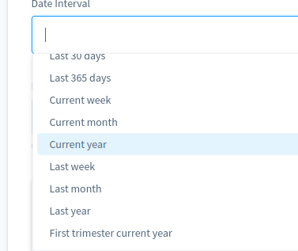

#Developer Guide

### Summary

 - [General concepts](#general-concepts)
 - [Database tables](#database-tables)
 - [Report types and fields](#report-types-and-fields)
   - [Configuration Schema](#configuration-schema)
   - [Creating a new report type](#creating-a-new-report-type)
     - [Via config files](#new-report-via-config-files)
     - [Via service](#new-report-via-service)
   - [Overwriting a report type or field](#overwriting-a-report-type-or-field)
   - [Using a different generator and factory for a report type](#using-a-different-generator-and-factory-for-a-report-type)
 - [Intervals](#intervals)
   - [Interval Schema](#interval-schema)
   - [Adding a new interval](#adding-a-new-interval)
     - [Via config files](#adding-interval-via-config-files)
     - [Via different php class](#adding-interval-via-different-php-class)
   - [Editing an interval](#editing-an-interval)
   - [Using an interval factory](#using-an-interval-factory)
 - [Operations](#operations)
   - [Operations Schema](#operations-schema)
   - [Creating a new operation](#creating-a-new-operation)
     - [Via config files](#adding-operation-via-config-files)
     - [Via php classes](#adding-operation-via-php-classes)
 - [Comparisons](#comparisons)
   - [Comparisons Schema](#comparisons-schema)
   - [Creating a new comparison](#creating-a-new-comparison)
     - [Via config files](#adding-comparison-via-config-files)
     - [Via php classes](#adding-comparison-via-php-classes)
 - [Field Types config](#field-types-config)
   - [Field Type Schema](#field-type-schema)
 - [Translations](#translations)
 - [Service tags](#service-tags)
 - [Export Reports](#export-reports)
 - [Developer mode](#developer-mode)

<a id="general-concepts"></a>
### General concepts
All the elements with logic like report types, intervals, operations, comparisons are retrieved via configuration files and can be easily extended, replaced, disabled using symfony services and composition.  

<a id="database-tables"></a>
# Database tables
ModigReportBuilder plugin adds 2 tables in the database to store the reports configurations and translations similar to any other core shopware entity  

- `modig_report_builder_report` - the main report table:
  - `id` - PK, UUID format - auto-generated;
  - `interval` - varchar - reference to the default interval for the report;
  - `type` - varchar - reference to the entity type in the report;
  - `columns` - JSON with columns configuration that should appear in the generated report;
  - `conditions` - JSON with conditions / filters for the data that should appear in the generated report;
  - `from_date` - datetime field, used for filtering entities in the report on a specific interval;
  - `to_date` - datetime field, used for filtering entities in the report on a specific interval;
  - `created_at` - datetime, stores when the report was created;
  - `updated_at` - datetime, stores when the report was last updated;
- `modig_report_builder_report_translation` - stores language dependent report data:
  - `name`: the name of the report - for internal use;
  - `description`: the description of the report - for internal use;
  - `created_at`: datetime - stores when the translation was created;
  - `updated_at`: datetime - stores when the translation was last updated;
  - `modig_report_builder_report_id`: UUID - reference to the main report entity;
  - `language_id`: UUID - reference to the language for which the translations apply.

<a id="report-types-and-fields"></a>
### Report types and fields
The report types represent the entities on which you create reports.
The report types and fields are retrieved from configuration files by default, but different sources can be used. The aggregated configuration of these sources are validated by a configuration schema located in `Modig\ReportBuilder\Config\Schema\ReportType`. The configuration is build using the symfony custom configuration creation recommendations.  

<a id="configuration-schema"></a>
#### Configuration Schema
- `code` - required, unique identifier for the entity type. If the same identifier is found in 2 or more configuration files, the child values for the entity type will be merged, the second config file overwriting the previous one
- `label` - the translation key for the entity type label. It can be left empty. If empty it will default to m`odig-report-builder.report_type.{code}` where `{core}` is the code of the report type defined above. Example: for the `order` entity type the label will default to `modig-report-builder.report_type.order`
- `main_table` - the name of the main table for which the report type is made. Example: for orders the table is `order`, for customers `customer`. If left empty, the `code` will be used as the table name
- `generator_key` - the config key of the generator class used to generate the report for the entity type. See the “Extending plugin elements“ section for more details. If left empty, the default generator class `Modig\ReportBuilder\Service\Generator\Generator`
- `interval_field` - the name of the table field on which the interval filters will be applied. It defaults to `created_at`
- `has_interval` - boolean flag. If set to false, the entity type will not support interval filters. It defaults to true
- `factory` - Based on the configuration, classes are instantiated to create objects. Providing a value to this field will allow you to use a different factory class to instantiate the report type. If empty the class `Modig\ReportBuilder\Model\ReportType\Factory` will be used to instantiate the report type.
- `additional` - array element where you can add custom configurations to your report type. It can be used in combination with a custom factory. 
- `sortOrder` - integer, it determines the order in which the report type will appear in different lists
- `fields` - the list of fields available for the current report type:
  - `code` - required, unique identifier among the fields in the same entity type. If the same identifier is used in 2 or more configuration files, the child values for the field will be merge, the second config file overwriting the previous one 
  - `label` - the translation key for the field. if empty it will default to m`odig-report-builder.{entity_code}.field.{code}` where `{entity_code}` is the entity type code and `{code}` is the field code. Example: for the `order` entity type and `net_amount` field the label will default to `modig-report-builder.order.field.net_amount`
  - `type`: the type of the field. this is used to determine what operations and comparisons can be applied to the field. it defaults to `decimal`. See here the list of supported types.
  - `table_alias`: an alias for the table where the field resides. It should be used when a report type uses fields from other tables than the main table. It defaults to `main_table`
    - Example for using fields from a different table.  In the order report type you can retrieve the billing country id from the order address table. this can be done in the configuration file like this:


```yaml

- code: order_billing_address_country_id #unique code
  table_alias: order_billing_address #table alias for the field because the field is from a different table. It should be the same as in the joins section.
  field_name: country_id #field name from the order_address table
  sortOrder: 190
  type: uuid #type of the field
  options: country #available options for the field
  joins: #how to reach the field with joins - can be one single join or multiple
    - refTable: order_address #the actual name of the table where the field resides
      refField: order_id #the foreign key field
      field: id #the field on which the join is made
      alias: order_billing_address #the table alias. It allows you join the same table multiple times
```

   - fields: # the list of fields available for the current report type:
     - skip_table_alias: # boolean flag, defaults to false. You can set it to true in case you added the alias directly in the field name or you are creating a composite field
     - field_name: # the actual field name in the database. it defaults to the code if left empty
     - sortOrder: # the order in which the fields appear int he admin UI
     - options: # in case this field supports only specific values, this element should contain the key for the service that provides the list of available values. Useful if the field is a FK to a different table. For example: countries, states, languages. If left empty, it means that the field does not have fixed options
     - column: # array element where you can override the values above only for the columns. So you can have different labels or factories for the same field when it appears in the columns sections than in the conditions sections
       - enabled: true #defaults to true. if set to false, the field will not appear in the columns section. Useful in case you want a field to appear only in the conditions section
       - label: #can be used to provide a different label in the columns section. it defaults to the main label of the field if left empty
       - field_name: # you can provide a different field name in the columns section. It defaults to the main field name if left empty
       - field_factory: # the service key used to instantiate the field when used in the columns UI section - if empty, `Modig\ReportBuilder\Model\ColumnField\Factory` will be used
       - factory: # the service key used to instantiate the field as a column when generating the report - if empty `Modig\ReportBuilder\Model\Column\Factory` will be used.
     - condition: # array element where you can override the values above only for conditions. So you can have different labels or factories for the same field when it appears in the conditions sections than in the columns section
       - label: # can be used to provide a different label in the conditions section. it defaults to the main label of the field if left empty
       - field_name: # you can provide a different field name in the conditions section. It defaults to the main field name if left empty
       - field_factory: # the service key used to instantiate the field when used in the conditions UI section - if empty, `Modig\ReportBuilder\Model\ConditionField\Factory` will be used
       - factory: # the service key used to instantiate the field as a condition when generating the report - if empty `Modig\ReportBuilder\Model\Condition\Factory` will be used.
       - use_having: # boolean flag. for some calculated conditions you cannot use `where` when applying the condition and `having` should be used.  If set to true “having“ will be used [https://www.geeksforgeeks.org/having-vs-where-clause-in-sql/ ](https://www.geeksforgeeks.org/having-vs-where-clause-in-sql/)
       - value_processor:  # in certain cases the values provided in the conditions UI need to be processed before transformed into an SQL query. if this is the case, the value provided here is the key of the service that processes the values. If is empty the value will be used as provided in the UI.
     - joins: # list of table joins needed to reach the field
       - refTable: # - the table to join with the main table
       - refField: # - the FK in the table to join
       - field: # - the field in the main table used in the join
       - join: # - the type of join (left, right, inner). Defaults to left
       - alias:#  - the alias of the table to join
       - Example. The following configuration for the orders report type:
       ```yaml
       - code: order_billing_address_country_id
         table_alias: order_billing_address 
         field_name: country_id
         sortOrder: 190
         type: uuid
         options: country 
         joins:
           - refTable: order_address
             refField: order_id
             field: id
             alias: order_billing_address
          
       ```
will be transformed into this query

```
SELECT HEX(order_billing_address.country_id) [,...] from `order` main_table LEFT JOIN `order_address` order_billing_address ON main_table.id=order_billing_address.order_id
```

<a id="creating-a-new-report-type"></a>
#### Creating a new report type
ModigReportBuilder allows you to extend the functionality to other entities in your application in different ways from your own plugins. For the examples below we consider a plugin named `AcmeReports` in which you want to get reports on the apps installed on your shopware instance. App references are stored in the `app` table. 

<a id="new-report-via-config-files"></a>
##### Via config files
You can add new entity types by creating in your application in one of your custom plugins a new configuration file and attaching it to the main configuration loader. 

Create the configuration file `Resources/config/report-builder/entity/app.yaml`. The file can be located anywhere in the plugin, but this is the recommended path for consistency.

```
type:
  - code: app #the code of the report type
    sortOrder: 3000 #adjust the sort order depending on where you want it in the UI list. the smaller the sort order the higher it appears in the list
    fields: #define the fields that shoould be available for this report type
      - code: name
        type: string
        sortOrder: 10
      - code: author
        type: string
      - code: created_at
        type: datetime
      - code: privacy
        type: string
        condition:
          enabled: false # we don't want this field to appear in the conditions section
```

and now, tell Shopware to load this new file using the default file loader along with the rest of the configuration files in `Resources/config/services.xml` add this:

```
<services>
    <service 
        id="modig.report-builder.config.report-type.loader.app"
        class="Modig\ReportBuilder\Config\Loader"> <!-- service id is not important, but it must be unique you can use a different loader class if you want, this is the default class -->
        <argument key="$file" type="string">@AcmeReports/Resources/config/report-builder/app.yaml</argument><!-- path to the file to be loaded -->
        <argument key="$schema" type="service" id="Modig\ReportBuilder\Config\Schema\ReportType" /> <!-- config validation schema -->
        <tag name="modig.report-builder.config.report-type.loader" priority="1000" /><!-- special tag used my the report builder plugin to load configurations. Priority determines the order in which order the files are loaded. The order is higher to lower -->
    </service>
</services>
```
That’s it! You’re done. Your new entity will be taken into account. 


The labels are not translated. For translations, check the translations section in the documentation.

<a id="new-report-via-service"></a>
##### Via service.
You can also add entities via custom loaders without using configuration files. This may be useful if you want logic in the result.

Lets do the same report entity as above but with a separate loader service.

Create a new loader service. Let’s call it `Acme\Reports\Config\Loader\App`  that must implement the interface `Modig\ReportBuilder\Config\Loader\LoaderInterface`

```
<?php

declare(strict_types=1);

namespace Acme\Reports\Config\Loader;

use Modig\ReportBuilder\Config\Loader\LoaderInterface;

class App implements LoaderInterface
{
    public function load(): array
    {
        return [
            'type' => [
                'app' => [
                    'code' => 'app',
                    'sortOrder' => 10,
                    'fields' => [
                        'name' => [
                            'code' => 'name',
                            'type' => 'string',
                            'sortOrder' => 100,
                        ],
                        'author' => [
                            'code' => 'author',
                            'type' => 'string',
                        ],
                        'created_at' => [
                            'code' => 'created_at',
                            'type' => 'datetime',
                        ],
                        'privacy' => [
                            'code' => 'privacy',
                            'type' => 'string',
                            'condition' => [
                                'enabled' => false
                            ]
                        ],
                    ]
                ]
            ]
        ];
    }
}

```

Now tell the report builder plugin to use your new config loader

In `Resources/config/services.xml` add this

```
<service id="modig-report-builder.condig.report-type.loader.app" class="Acme\Reports\Config\Loader\App">
    <tag name="modig.report-builder.config.report-type.loader" priority="1000" /><!-- special tag used my the report builder plugin to load configurations. Priority determines the order in which order the files are loaded. The order is higher to lower -->
</service>
```

The result will be the same as the with the configuration files.

Now you can use logic inside the `load` method to determine what fields need to be be added or not. Could be useful if you want to scan a table schema or you want to read values from a different source.


<a id="overwriting-a-report-type-or-field"></a>
#### Overwriting a report type or field
You can overwrite data for one report type or a field using the same principle as for creating a new report type. 

As an example, let’s say you want to disable the reports for customers and you want to rename the order items report to “Products Bought“.

Create the configuration file `Resources/config/report-builder/entity/customer-disable.yaml`. The file can be located anywhere in the plugin, but this is the recommended path for consistency.

```
type:
  - code: customer #the code of the report type to be extended
    enabled: false # this will disable the report types
  - code: order_line_item
    label: "Products Bought"
```

Now tell Shopware to load this new file using the default file loader along with the rest of the configuration files

In `Resources/config/services.xml` add this

```
<services>
    <service 
        id="modig.report-builder.config.report-type.loader.customer-disable"
        class="Modig\ReportBuilder\Config\Loader"> <!-- service id is not important, but it must be unique you can use a different loader class if you want, this is the default class -->
        <argument key="$file" type="string">@AcmeReports/Resources/config/report-builder/customer-disable.yaml</argument><!-- path to the file to be loaded -->
        <argument key="$schema" type="service" id="Modig\ReportBuilder\Config\Schema\ReportType" /> <!-- config validation schema -->
        <tag name="modig.report-builder.config.report-type.loader" priority="10" /><!-- special tag used my the report builder plugin to load configurations. make sure the priority is lower than the one for the order_line_item report type and for customer report type -->
    </service>
</services>
```

That’s it. You’re done. Your new entity will be taken into account.  The customer reports are gone and the Order Line items report is renamed to Product Bought.


<a id="using-a-different-generator-and-factory-for-a-report-type"></a>
#### Using a different generator and factory for a report type
In case you want a different behavior for your entity type you can use a different factory class to instantiate the report type or a different generator class to generate the report.

For this you need to create a new config file in your plugin as explained above with a few changes. 

```
type:
  - code: app #the code of the report type
    generator_key: my_generator #this value can be anything other than _default
    factory: my_factory #this value can be anything other than _default
    fields: 
      - ....
```
Create a new factory class that must implement `Modig\ReportBuilder\Model\ReportType\FactoryInterface`.

```
<?php

declare(strict_types=1);

namespace Acme\Reports\Model\ReportType;

use Modig\ReportBuilder\Model\ReportType\FactoryInterface;

class MyFactory implements FactoryInterface
{
    public function create(array $data): ReportTypeInterface
    {
        ....
    }
}
```

Now declare your new class as a service that acts as a factory for a report type:

```
<service id="Acme\Reports\Model\ReportType\MyFactory"> <!-- your new class name -->
    <tag name="modig.report-builder.report-type.factory" key="my_factory" lazy="true" />
    <!-- Special tag that marks the service as a report type factory.  -->
    <!-- The "key" attribute must be the same as declared in the config file-->
    <!-- lazy=true is used to not instantiate the class until it is actually needed-->
</service>

```
For alternative generators the process is the same. 

A new generator class can be created that implements `Modig\ReportBuilder\Service\Generator\GeneratorInterface`

```
<?php

declare(strict_types=1);

namespace Acme\Reports\Service\Generator;

use Modig\ReportBuilder\Service\Generator\GeneratorInterface;
use DateTimeImmutable;
use Modig\ReportBuilder\Core\Content\Report\ReportEntity;
use Modig\ReportBuilder\Model\Result\ResultInterface;

class MyGenerator implements GeneratorInterface
{
    public function generate(
        ReportEntity $report,
        ?string $interval = null,
        ?DateTimeImmutable $from = null,
        ?DateTimeImmutable $until = null,
        ?int $pageNumber = null,
        ?int $pageSize = null
    ): Result\ResultInterface {
        ....
    }
}
```

and declare your new service as a report generator:

```
<service id="Acme\Reports\Service\Generator\MyGenerator"><!-- your class name -->
    <tag name="modig.report-builder.generator" key="my_generator" lazy="true" />
    <!-- special tag name used by the plugin to identify generators -->
    <!-- The "key" attribute must be the same as declared in the config file -->
    !-- lazy=true is used to not instantiate the class until it is actually needed-->
</service>
```
<a id="intervals"></a>
### Intervals
Intervals act as a filter in your report based on when the entity was created. 

The intervals are retrieved from configuration files by default, but different sources can be used. The aggregated configuration of these sources are validated by a configuration schema located in `Modig\ReportBuilder\Config\Schema\Interval`. The configuration is build using the symfony [custom configuration creation recommendations](https://symfony.com/doc/current/bundles/configuration.html).

<a id="interval-schema"></a>
## Interval Schema
- code: required, unique identifier for an interval. If the same code is used in 2 or more configuration files, the interval configuration will be merged, the second config file overriding the previous one.
- enabled: boolean flag. If set to false, it disables the current interval and removes it completely from the UI. Defaults to true.
- label: - the translation key for the interval name. If left empty it will default to `modig-report-builder.interval.label.{code}` where `{code}` is the interval code. Example the interval with code `last_month` will have the default label `modig-report-builder.interval.label.last_month`
- from - string value that can be parsed by the `DateTimeImutable` constructor to transform in a real date value. This is the lower bound of the interval. If empty, the interval will have no lower bound
- to - string value that can be parsed by the `DateTimeImutable` constructor to transform in a real date value. This is the upper bound of the interval. if empty, the interval will have no upper bound
- factory - the service key used to instantiate the interval class. if left empty, `Modig\ReportBuilder\Model\Interval\Factory` will be used.
- sortOrder - the order in which the interval will be displayed in the UI
- additional - array element where you can add different values in case you use a different factory for the interval

<a id="adding-a-new-interval"></a>
#### Adding a new interval
ModigReportBuilder allows you to extend the functionality with other intervals in different ways from your own plugins. For the examples below we consider a plugin named `AcmeReports` in which you want to add new intervals or change existing ones.

Lets say you want to create a new interval called “First trimester of current year“ which spans from January 1st to March 31st this year.

<a id="adding-interval-via-config-files"></a>
##### Via config files
Create a new configuration file `Resources/config/report-builder/interval.yaml`.The file can be located anywhere in the plugin, but this is the recommended path for consistency.

```
interval:
  - code: first_trimester
    label: "First trimester current year"
    from: 'january 1 00:00:00'
    to: 'march 31 23:59:59'
```
Now tell shopware to load your new config file. In `services.xml` add this:

```
<!-- service id is not important but it myst be unique. As class name we use the default config loader class -->
<service id="modig.report-builder.config.interval.loader.first_trimester" class="Modig\ReportBuilder\Config\Loader">
    <!-- location of the file to be loaded -->
    <argument key="$file" type="string">@AcmeReports/Resources/config/report-builder/interval.yaml</argument>
    <!-- schema class to validate the config file -->
    <argument key="$schema" type="service" id="Modig\ReportBuilder\Config\Schema\Interval" />
    <!-- special tag name that means the service should load interval data -->
    <!-- priority decides the order in which the interval config files are loaded. from highest to lowest-->
    <tag name="modig.report-builder.config.interval.loader" priority="100" />
</service> 
```
That’s it. now you have a new interval:



<a id="adding-interval-via-different-php-class"></a>
##### Via different php class
The same outcome as above can be achieved via a php class as follows.

A new config loader class should be created. Let’s call it `Acme\Reports\Config\Loader\Interval` which must implement `Modig\ReportBuilder\Config\Loader\LoaderInterface`:

```
<?php

declare(strict_types=1);

namespace Acme\Reports\Config\Loader;

use Modig\ReportBuilder\Config\Loader\LoaderInterface;

class Interval implements LoaderInterface
{
    public function load(): array
    {
        return [
            'interval' => [
                'first_trimester' => [
                    'code' => 'first_trimester',
                    'sortOrder' => 10,
                    'label' => 'First trimester of this year',
                    'from' => 'january 1 00:00:00',
                    'to' => 'march 31 23:59:59'
                ]
            ]
        ];
    }
}
```
Now declare the new loader class as an interval loader:

```
<!-- service id is not important but it myst be unique. As class name we use the default config loader class -->
<service id="modig.report-builder.config.interval.loader.first_trimester" class="Acme\Reports\Config\Loader\Interval">
    <!-- special tag name that means the service should load interval data -->
    <!-- priority decides the order in which the interval config files are loaded. from highest to lowest-->
    <tag name="modig.report-builder.config.interval.loader" priority="100" />
</service>
```

<a id="extending-an-interval"></a>
#### Editing an interval
Let’s say you want to change the label of the interval “Since the Big Bang“ to “Since Forever“. and you want to remove the interval “Last week“

Create the config file as described above `Resources/config/report-builder/interval.yaml`:

```
interval:
  - code: since_the_big_bang #the code of the interval to change
    label: "Since Forever"
  - code: last_week #code of interval to change
    enabled: false #disables the interval
```
And add the config file to the loaded files:

```
<!-- service id is not important but it myst be unique. As class name we use the default config loader class -->
<service id="modig.report-builder.config.interval.loader.custom_intervals" class="Modig\ReportBuilder\Config\Loader">
    <!-- location of the file to be loaded -->
    <argument key="$file" type="string">@AcmeReports/Resources/config/report-builder/interval.yaml</argument>
    <!-- schema class to validate the config file -->
    <argument key="$schema" type="service" id="Modig\ReportBuilder\Config\Schema\Interval" />
    <!-- special tag name that means the service should load interval data -->
    <!-- priority decides the order in which the interval config files are loaded. from highest to lowest-->
    <tag name="modig.report-builder.config.interval.loader" priority="100" />
</service>   
``` 

<a id="using-an-interval-factory"></a>
#### Using an interval factory
Let’s say you want an interval that says “Since my last birthday“. This cannot be achieved strictly from configuration files because “my last birthday“ is relative to the current date. so the filter might need to be applied from “my“ birthday last year if my birthday is later this year, and from “my“ birthday this year if it already passed. Let’s assume my birthday is on August 18.

Create a configuration file as above `Resources/config/report-builder/interval.yaml`

```
interval:
  - code: since_my_last_birthday #code of the interval
    factory: my_birthday #service key for the interval class factory
```
Now let’s create the interval class that handles my birthday `Acme\Reports\Model\Interval\MyBirthday` that implements `Modig\ReportBuilder\Model\Interval\IntervalInterface`

```
<?php

declare(strict_types=1);

namespace Acme\Reports\Model\Interval;

use DateTimeImmutable;
use Modig\ReportBuilder\Service\DateTimeFactory;
use Modig\ReportBuilder\Model\Interval\IntervalInterface;

class MyBirthday implements IntervalInterface
{
    private DateTimeFactory $factory;
    private string $code;

    /**
     * @param DateTimeFactory $factory
     * @param string $code
     */
    public function __construct(DateTimeFactory $factory, string $code)
    {
        $this->factory = $factory;
        $this->code = $code;
    }

    public function getCode(): string
    {
        return $this->code;
    }
    public function getLabel(): string
    {
        return 'Since my last Birthday'; //the label will be always this
    }

    public function getFromDate(): ?DateTimeImmutable
    {
        $day = '-08-18';//August 18th
        $today = $this->factory->create('now');
        $thisYear = $today->format('Y');
        $thisYearBirthday = $this->factory->create( $thisYear. $day);
        //if I already had my birthday party this year, return this year's day, otherwise the one from last year.
        return $thisYearBirthday < $today
            ? $thisYearBirthday
            : $this->factory->create(($thisYear - 1) . $day);
    }

    public function getToDate(): ?DateTimeImmutable
    {
        return null; //there is no upper limit to the interval
    }
}
```
Now we need to create a factory that would instantiate this class and which should implement the `Modig\ReportBuilder\Model\Interval\FactoryInterface`

```
<?php

declare(strict_types=1);

namespace Acme\Reports\Model\Interval;

use Modig\ReportBuilder\Config\Schema\Interval as IntervalSchema;
use Modig\ReportBuilder\Model\Interval\FactoryInterface;
use Modig\ReportBuilder\Model\Interval\IntervalInterface;
use Modig\ReportBuilder\Service\DateTimeFactory;
use Acme\Reports\Model\Interval\MyBirthday;

class Factory implements FactoryInterface
{
    private DateTimeFactory $dateTimeFactory;

    /**
     * @param DateTimeFactory $dateTimeFactory
     */
    public function __construct(DateTimeFactory $dateTimeFactory)
    {
        $this->dateTimeFactory = $dateTimeFactory;
    }

    /**
     * @param array $data
     * @return IntervalInterface
     */
    public function create(array $data): IntervalInterface
    {
        return new MyBirthday(
            $this->dateTimeFactory,
            $data[IntervalSchema::CODE],
        );
    }
}
```
Now tell Shopware to load your config file and to identify your factory service as an interval factory:

```
<!-- service id is not important but it myst be unique. As class name we use the default config loader class -->
<service id="modig.report-builder.config.interval.loader.custom_intervals" class="Modig\ReportBuilder\Config\Loader">
    <!-- location of the file to be loaded -->
    <argument key="$file" type="string">@AcmeReports/Resources/config/report-builder/interval.yaml</argument>
    <!-- schema class to validate the config file -->
    <argument key="$schema" type="service" id="Modig\ReportBuilder\Config\Schema\Interval" />
    <!-- special tag name that means the service should load interval data -->
    <!-- priority decides the order in which the interval config files are loaded. from highest to lowest-->
    <tag name="modig.report-builder.config.interval.loader" priority="100" />
</service>

<service id="Acme\Reports\Model\Interval\Factory">
    <!-- special tag to idendify the service as an interval factory-->
    <!-- the key attribute should be the same as provided in the configuration file -->
    <tag name="modig.report-builder.interval.factory" key="my_birthday" />
</service>
```

<a id="operations"></a>
### Operations
The operations are SQL functions you can apply to the fields involved in the report columns and conditions. for some of these operations you can group the results for others you cannot. For example you cannot group by a `COUNT(*)` statement.

The operations are retrieved from configuration files by default, but different sources can be used. The aggregated configuration of these sources are validated by a configuration schema located in `Modig\ReportBuilder\Config\Schema\Operation`. The configuration is build using the symfony [custom configuration creation recommendations](https://symfony.com/doc/current/bundles/configuration.html).

<a id="operations-schema"></a>
#### Operations Schema
- `code`:  required unique identifier for the operation. If the same identifier is found in 2 or more configuration files, the child values for the operation will be merged, the second config file overwriting the previous one;
- `enabled`: boolean flag. By default, is set to true. If set to false, the operation will be completely disabled and not available in the application;
- `label`: string value. It represents the translation key of the operation title. If left empty it defaults to `modig-report-builder.operation.{code}` where `{code}` is the code of the operation;
- `can_group`: boolean flag. It tells the application if you can group by the field when the current operation is applied. Defaults to true;
- `factory`: the service key for the factory service used to instantiate the Operation object. If left empty, it defaults to `_default` and the class `Modig\ReportBuilder\Model\Operation\Factory` will be used to instantiate the operation;
- `sortOrder`:: numerical value, it determines the position of the operation in the UI. The smaller the value, the higher it appears in the list;
- `sql_function`: The sql expression to be applied by the operation. Example: `MAX`, `MIN`. If the function has parameters, use `(*)` as a placeholder for the field name. Example, `ROUND((*), 2)`. If empty it will default to the operation code;
- `additional`: array element. Not used in the application, but it can be useful to store certain data in case you want to use a different factory for your operation.

<a id="creating-a-new-operation"></a>
#### Creating a new operation
ModigReportBuilder allows you to add different operations in your application in different ways from your own plugins. For the examples below we consider a plugin named `AcmeReports` in which we will add a new operation.
Lets say you want to add an operation that converts the strings to uppercase.  

<a id="adding-operation-via-config-files"></a>
##### Via config files
You can add new operation by creating in your application in one of your custom plugins a new configuration file and attaching it to the main configuration loader.
Create the configuration file `Resources/config/report-builder/operation.yaml`. The file can be located anywhere in the plugin, but this is the recommended path for consistency.  

```
operation:
  - code: uppercase #the code of the operation. 
    label: Uppercase # can be skipped
    sortOrder: 3000 #adjust the sort order depending on where you want it in the UI list. the smaller the sort order the higher it appears in the list
    can_group: true #you can group by an uppercase string
    sql_function: ucase
```
Now tell shopware to load your file:

```
<!-- the service id is not important but it should be unique in the application -->
<!-- the class name is the class used to load your new file-->
<service id="modig.report-builder.config.operation.loader.uppercase" class="Modig\ReportBuilder\Config\Loader">
    <!-- the path of the file to be loaded -->
    <argument key="$file" type="string">@AcmeReports/Resources/config/report-builder/operation.yaml</argument>
    <!-- the validation schema for your file-->
    <argument key="$schema" type="service" id="Modig\ReportBuilder\Config\Schema\Operation" />
    <!-- special tag to idendify the service as an operation config loader-->
    <!-- the priority tells shopware in which order to load the config files. from highest to lowes-->
    <tag name="modig.report-builder.config.operation.loader" priority="1000" />
</service>
```
Now the application knows about your operation, but you will not see it in the UI because operations depend on the field types. 

Let’s say that we want the operation to be applicable to all string fields. More details about field types and links to operations and comparisons will be covered in the field types section.

For this we create a new config file `Resources/config/report-builder/field-type.yaml`.

```
type:
  - code: string
    operations:
      - code: uppercase
```
and tell shopware to load this file also

```
<service id="modig.report-builder.config.field-type.loader.uppercase" class="Modig\ReportBuilder\Config\Loader">
    <argument key="$file" type="string">@Acmereports/Resources/config/report-builder/field-type.yaml</argument>
    <argument key="$schema" type="service" id="Modig\ReportBuilder\Config\Schema\FieldType" />
    <!-- special tag to tell shopware that this service should be used as a field type loader.-->
    <tag name="modig.report-builder.config.field-type.loader" priority="10000" />
</service>
```
Now your string fields should support the uppercase operation:


<a id="adding-operation-via-php-classes"></a>
##### Via php classes
The same result as above can be achieved via php classes.
Let’s create a new operation config loader class that implements `Modig\ReportBuilder\Config\Loader\LoaderInterface`  
    
```
<?php 

declare(strict_types=1);

namespace Acme\Reports\Config\Loader;

use Modig\ReportBuilder\Config\Loader\LoaderInterface;

class Operation implements LoaderInterface
{
    public function load(): array
    {
        return [
            'operation' => [
                'uppercase' => [
                    'code' => 'uppercase',
                    'sortOrder' => 1000,
                    'sql_functin' => 'ucase'
                ]
            ]
        ];
    }
}
```
and one class that assigns the `ucase` operation to the string type

```
<?php 

declare(strict_types=1);

namespace Acme\Reports\Config\Loader;

use Modig\ReportBuilder\Config\Loader\LoaderInterface;

class FieldType implements LoaderInterface
{
    public function load(): array
    {
        return [
            'type' => [
                'string' => [
                    'code' => 'string',
                    'operations' => [
                        'uppercase' => [
                            'code' => 'uppercase'
                        ]
                    ]
                ]
            ]
        ];
    }
}

```
Now we tell shopware to attach 2 services above to the proper config loaders.

```
<!-- the service id is not important but it should be unique in the application -->
<!-- the class name is the class used to load your new file-->
<service id="modig.report-builder.config.operation.loader.uppercase" class="Acme\Reports\Config\Loader\Operation">
    <!-- special tag to idendify the service as an operation config loader-->
    <!-- the priority tells shopware in which order to load the config files. from highest to lowes-->
    <tag name="modig.report-builder.config.operation.loader" priority="1000" />
</service>
<service id="modig.report-builder.config.field-type.loader.uppercase" class="Acme\Reports\Config\Loader\FieldType">
    <!-- special tag to tell shopware that this service should be used as a field type loader.-->
    <tag name="modig.report-builder.config.field-type.loader" priority="10000" />
</service>
```
<a id="comparisons"></a> 
### Comparisons  
The comparison are applied inside conditions to compare a field to a specific value.
The comparisons are retrieved from configuration files by default, but different sources can be used. The aggregated configuration of these sources are validated by a configuration schema located in `Modig\ReportBuilder\Config\Schema\Comparison`. The configuration is build using the symfony [custom configuration creation recommendations](https://symfony.com/doc/current/bundles/configuration.html).  

<a id="comparisons-schema"></a>
#### Comparisons Schema
- code:  required unique identifier for the operation. If the same identifier is found in 2 or more configuration files, the child values for the operation will be merged, the second config file overwriting the previous one;
- enabled: boolean flag. By default is set to true. If set to false, the operation will be completely disabled and not available in the application;
- label: string value. It represents the translation key of the operation title. If left empty it defaults to `modig-report-builder.comparison.{code}` where `{code}` is the code of the operation;
- factory: the service key for the factory service used to instantiate the Comparison object. If left empty, it defaults to `_default` and the class `Modig\ReportBuilder\Model\Comparison\Factory` will be used to instantiate the comparison.
- sortOrder: numerical value, it determines the position of the comparison in the UI. The smaller the value, the higher it appears in the list;
- additional: array element. Not used in the application, but it can be useful to store certain data in case you want to use a different factory for your comparison.

<a id="creating-a-new-comparison"></a>
#### Creating a new comparison
ModigReportBuilder allows you to add different comparisons in your application in different ways from your own plugins. For the examples below we consider a plugin named `AcmeReports` in which we will add a new comparison.  
Lets say you want to add an comparisons that would state a string does not start with and does not end with a specific sub string (the same one).  

<a id="adding-comparison-via-config-files"></a>
##### Via config files
You can add new operation by creating in your application in one of your custom plugins a new configuration file and attaching it to the main configuration loader.
Create the configuration file `Resources/config/report-builder/comparison.yaml`. The file can be located anywhere in the plugin, but this is the recommended path for consistency.  

```
comparison:
  - code: notStartsAndNotEndsWith #the code of the operation.
    label: "Does not start and does not end with" # can be skipped
    sortOrder: 3000 #adjust the sort order depending on where you want it in the UI list. the smaller the sort order the higher it appears in the list
```
Now tell shopware to load your file:

```
<!-- the service id is not important but it should be unique in the application -->
<!-- the class name is the class used to load your new file-->
<service id="modig.report-builder.config.comparison.loader.notStartsNotEnds" class="Modig\ReportBuilder\Config\Loader">
    <!-- the path of the file to be loaded -->
    <argument key="$file" type="string">@AcmeReports/Resources/config/report-builder/comparison.yaml</argument>
    <!-- the validation schema for your file-->
    <argument key="$schema" type="service" id="Modig\ReportBuilder\Config\Schema\Comparison" />
    <!-- special tag to idendify the service as an operation config loader-->
    <!-- the priority tells shopware in which order to load the config files. from highest to lowes-->
    <tag name="modig.report-builder.config.comparison.loader" priority="1000" />
</service>
```
Now the application knows about your comparison, but you will not see it in the UI because comparisons depend on the field types. 

Let’s say that we want the comparison to be applicable to all string fields. More details about field types and links to operations and comparisons will be covered in the field types section.

For this we create a new config file `Resources/config/report-builder/field-type.yaml`.

```
type:
  - code: string
    comparisons:
      - code: notStartsAndNotEndsWith
```
and tell shopware to load this file also

```
<service id="modig.report-builder.config.field-type.loader.notStartsAndNotEndsWith" class="Modig\ReportBuilder\Config\Loader">
    <argument key="$file" type="string">@Acmereports/Resources/config/report-builder/field-type.yaml</argument>
    <argument key="$schema" type="service" id="Modig\ReportBuilder\Config\Schema\FieldType" />
    <!-- special tag to tell shopware that this service should be used as a field type loader.-->
    <tag name="modig.report-builder.config.field-type.loader" priority="10000" />
</service>
```
Now your string fields should support the new comparison:


But doctrine does not know what `notStartsAndNotEndsWith` means. Now we need to say to the query builder what this new comparison does.

For this we need a new class. that implements `Modig\ReportBuilder\Service\Doctrine\MapperInterface`.

```
<?php


declare(strict_types=1);

namespace Acme\Reports\Service\Doctrine;

use Doctrine\DBAL\Connection;
use Doctrine\DBAL\Query\QueryBuilder;
use Modig\ReportBuilder\Model\Condition\ConditionInterface;

class NotStartsAndNotEndsWith implements MapperInterface
{
    public function getExpression(QueryBuilder $builder, ConditionInterface $condition): string
    {
        if (!$condition->getField()) {
            return '';
        }
        $value = $condition->getValue(); //the value to which we compare it to
        //our comparison translate to "db field NOT LIKE '$value' . '%' AND db field NOT LIKE '%' . $value"
        So we need 2 parameters
        //a doctrine query parameter and make sure its name is unique
        $paramOne = ':' . preg_replace('/[^a-zA-Z0-9_]/', '_', uniqid($condition->getField() . '_'));
        $paramTwo = ':' . preg_replace('/[^a-zA-Z0-9_]/', '_', uniqid($condition->getField() . '_'));
        //attach the parameters to the query builder
        $builder->setParameter($paramOne, $value . '%');
        $builder->setParameter($paramTwo, '%' . $value);
        $conditions = [
            $builder->expr()->notLike($condition->getField(), $paramOne),
            $builder->expr()->notLike($condition->getField(), $paramTwo)
        ];
        return '(' . implode(' AND ', $conditions) . ')';
    }
}
```
And now we attach this service to the list of comparison services:

```
<service class="Acme\Reports\Service\Doctrine\NotStartsAndNotEndsWith">
    <!-- special tag to attach the service to the list of comparisons -->
    <!-- the key should match the comparison code-->
    <tag name="modig.report-builder.doctrine.mapper" key="notStartsAndNotEndsWith" />
</service>
```

<a id="adding-comparison-via-php-classes"></a>
##### Via php classes
The same result as above can be achieved via php classes.  
Let’s create a new operation config loader class that implements `Modig\ReportBuilder\Config\Loader\LoaderInterface`

```
<?php 

declare(strict_types=1);

namespace Acme\Reports\Config\Loader;

use Modig\ReportBuilder\Config\Loader\LoaderInterface;

class Comparison implements LoaderInterface
{
    public function load(): array
    {
        return [
            'comparison' => [
                'notStartsAndNotEndsWith' => [
                    'code' => 'notStartsAndNotEndsWith',
                    'sortOrder' => 1000,
                ]
            ]
        ];
    }
}

```
and one class that assigns the `notStartsAndNotEndsWith` comparison to the string type

```
<?php 

declare(strict_types=1);

namespace Acme\Reports\Config\Loader;

use Modig\ReportBuilder\Config\Loader\LoaderInterface;

class FieldType implements LoaderInterface
{
    public function load(): array
    {
        return [
            'type' => [
                'string' => [
                    'code' => 'string',
                    'comparisons' => [
                        'notStartsAndNotEndsWith' => [
                            'code' => 'notStartsAndNotEndsWith'
                        ]
                    ]
                ]
            ]
        ];
    }
}
```
Now we tell shopware to attach 2 services above to the proper config loaders

```
<!-- the service id is not important but it should be unique in the application -->
<!-- the class name is the class used to load your new file-->
<service id="modig.report-builder.config.comparison.loader.notStartsAndNotEndsWith" class="Acme\Reports\Config\Loader\Comnparison">
    <!-- special tag to idendify the service as an comparison config loader-->
    <!-- the priority tells shopware in which order to load the config files. from highest to lowes-->
    <tag name="modig.report-builder.config.comparison.loader" priority="1000" />
</service>
<service id="modig.report-builder.config.field-type.loader.notStartsAndNotEndsWith" class="Acme\Reports\Config\Loader\FieldType">
    <!-- special tag to tell shopware that this service should be used as a field type loader.-->
    <tag name="modig.report-builder.config.field-type.loader" priority="10000" />
</service>

```
<a id="field-types-config"></a>
### Field Types config   
The field types config allows you to attach or detach operations and comparisons to different config types.
The field type configurations are retrieved from configuration files by default, but different sources can be used. The aggregated configuration of these sources are validated by a configuration schema located in `Modig\ReportBuilder\Config\Schema\Comparison`. The configuration is build using the symfony [custom configuration creation recommendations](https://symfony.com/doc/current/bundles/configuration.html).  

<a id="field-type-schema"></a>
#### Field Type Schema
- `code`: required. unique identifier for the field type. If the same identifier is found in 2 or more configuration files, the child values for the operation will be merged, the second config file overwriting the previous one;
- `enabled`: boolean flag. May disable fields of a specific type. Defaults to true;
- `operations`: array element to supply the available operations or disable certain operations:
  - `code`: the code of the operation;
  - `enabled`: boolean flag. If set to false, the operation is disabled for this field type;
- `comparisons`: array element to supply the available comparisons or disable certain comparisons:
  - `code`: the code of the comparison.
  - `enabled`: boolean flag. If set to false, the comparison is disabled for this field type.

<a id="translations"></a>
### Translations
Because the roadmap of this plugin includes generation of reports from different channels not only the admin UI, the translations involved in the report results are attached to the server side translations. Any new translations you add to your custom entities, operations, comparisons should follow the same pattern. 

Let’s say you want to add new translations that should work serverside and client side in your `AcmeReports` module.

You can create a regular Shopware translation file located in `Resources/app/administration/src/module/acme-reports/snippet` with the same name as the language code. Let’s say we want a new english translation file so the file name will be `en-GB.json`.

By default, this will work for the admin ui translations. But let’s make it work for the backend also. 

If you have multiple languages in your app, you don’t need to do this multiple times. Only once and it will work for all language files

For this you can declare a new service that loads the file.

```
<!-- id of the service is not important but it should be unique -->
<service id="modig.report-builder.translations.source.acme-reports" class="Modig\ReportBuilder\Service\Translation\Provider">
    <argument key="$loader" type="service" id="translation.loader.json" />
    <!-- parent folder that contains tour translation files -->
    <argument key="$folder" type="string">@AcmeReports/Resources/app/administration/src/module/modig-report-builder/snippet</argument>
    <argument key="$format" type="string">json</argument>
    <!-- special tag to tell the plugin to load the file -->
    <tag name="modig.report-builder.translation.source" />
</service>
```

<a id="service-tags"></a>
### Service tags
Here is a list of service tags created and used by the `ModigReportBuilderPlugin`:  

- `modig.report-builder.translation.source` - used to mark a translation file loader service 
- `modig.report-builder.config.interval.loader` - used to mark a service that loads configurations for the intervals used in the reports
- `modig.report-builder.interval.factory` - used to mark a service as an interval factory service. When using this tag a key attribute needs to be provided.
- `modig.report-builder.config.source` - used to mark a service used in the controller that retrieves general data about reports configs (operations, comparisons, report types)
- `modig.report-builder.config.report-type.loader` - used to mark a service that loads data about he report types
- `modig.report-builder.report-type.factory` - used to mark a service as a report type factory
- `modig.report-builder.config.operation.loader` - used to mark a service that loads configurations for the operations used in the reports
- `modig.report-builder.operation.factory` - used to mark a service as an operation factory
- `modig.report-builder.config.comparison.loader` - used to mark a service that loads data about the comparisons
- `modig.report-builder.comparison.factory` - used to mark a service as a comparison factory
- `modig.report-builder.column-field.factory` - used to mark a service as a column field factory
- `modig.report-builder.config.entity-source` - used to mark a service used in a controller that retrieves data about report configs relative to a report type
- `modig.report-builder.condition-field.factory` - used to mark a service a s a condition field factory
- `modig.report-builder.config.field-type.loader` - used to load mark a service that loads config data about the field types
- `modig.report-builder.condition_field.option.provider` used to mark a service that provides options for the different database entities used in conditions (languages, countries, sales channels). It also requires a unique key attribute to identify it among others
- `modig.report-builder.generator` used to mark services that can generate reports
- `modig.report-builder.column.factory` - used to mark services that are column instance factories. It requires a key attribute to be identified based on the column field and the operation used in the column
- `modig.report-builder.condition.factory` - used to mark services that are condition factories. It requires a key to be identified based on the condition field type or the factory key supplied in config
- `modig.report-builder.column-formatter` - used to mark a service responsible for formatting data displayed in the generated report. Example: if you want to display the sales channel on which orders were placed, internally the sales channel UUID will be used for queries, but in the report you need to display the name of the channel
- `modig.report-builder.condition.value-processor` - used to mark services that transform condition values supplied in the conditions sections into SQL values. Example: if you add a condition for orders to be in 2 or more sales channels, internally the selected UUIDs will be read from the proper json element for the value.
- `modig.report-builder.doctrine.mapper` - marks services that transform UI condition comparisons to SQL WHERE or HAVING conditions via the doctrine query builder. It requires a key attribute to be identified among others
- `modig.report-builder.download` - marks a service that allows you to download a generated report in differetn formats.


<a id="export-reports"></a>
### Export Reports
The plugin comes with 3 export formats for a generated report. CSV, JSON and HTML.  
In order to add a new format you need to create a new class in one of your plugins that implements `Modig\ReportBuilder\Service\Download\DownloadInterface`.
The interface contains 2 methods  

- `getLabel()` - will return the label displayed in the admin UI for your export type
- `getContent()` - This is the method where you build the content of the file to be exported in your desired format. It must return `Symfony\Component\HttpFoundation\StreamedResponse` response.

After creating the class, declare it as a service in your services.xml file and tag it with `modig.report-builder.download`.

```
<service id="modig.report-builder.download.xml" class="My\ReportBuilder\Download\Xml">
    <tag name="modig.report-builder.download" key="xml" />
</service>
```

<a id="developer-mode"></a>
### Developer mode
For development purposes, you can enable developer mode from the plugin configuration section.  
This will display the query being executed while generating a report.  

